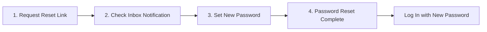

# Walkthrough: Professional Forgotten Password Reset & 100% Free Email Configuration

We have designed and implemented an enterprise-grade, secure, and responsive **Forgotten Password Reset** flow for RentPoint, accompanied by a step-by-step setup guide for **100% free forever** email delivery.

---

## What Was Implemented

### 1. Complete 4-Step Password Reset Flow



1. **Step 1: Request Password Reset (`/accounts/password-reset/`)**:
   - Clean, branded split-screen view matching RentPoint's design system.
   - User enters registered email.
   - Built-in **anti-enumeration protection**: displays a friendly confirmation screen regardless of whether the email exists, preventing bad actors from harvesting user emails.
   - Dispatches both a **branded responsive HTML email** and a plain-text fallback.

2. **Step 2: Email Dispatched Confirmation (`/accounts/password-reset/done/`)**:
   - Modern visual status card with numbered guidance (check spam folder, 24-hour expiration notice, try another email action).

3. **Step 3: Set New Password (`/accounts/password-reset/<uidb64>/<token>/`)**:
   - Cryptographically secure token verification using Django's HMAC token generator.
   - **Interactive Password Strength Meter**: Live 4-bar colored strength indicator (Weak / Fair / Good / Strong) that updates in real time as the user types.
   - **Password Requirement Checklist**: Real-time checklist (✓ At least 8 characters, ✓ Upper & lowercase letters, ✓ Number or special character) that checks off interactively.
   - **Password Confirmation Match Checker**: Instantly alerts user if password confirmation matches.
   - **Show / Hide Password Toggles**: Integrated eye toggle icons on both password fields.
   - **Invalid / Expired Token Fallback**: If a link is invalid, expired (> 24h), or already used, renders a dedicated alert card with a direct button to request a fresh link.

4. **Step 4: Reset Complete (`/accounts/password-reset/complete/`)**:
   - Confirms password change, invalidates previous sessions, and provides a direct "Log In Now" button to `/accounts/login/`.

---

### 2. 100% Free Forever Email Setup Guide ([docs/email.md](file:///c:/rentpoint/docs/email.md))

Created a comprehensive, step-by-step guide explaining how to send transactional emails for **$0 forever** without needing a credit card:

| Provider                         | Free Tier                      | Setup Ease                | Domain Needed?        |
| :------------------------------- | :----------------------------- | :------------------------ | :-------------------- |
| **Gmail SMTP (App Password)** ⭐ | **500 emails/day** (15,000/mo) | 3 simple steps            | No (any `@gmail.com`) |
| **Brevo (Sendinblue)**           | **300 emails/day** (9,000/mo)  | API / SMTP key            | Optional              |
| **Local Console Backend**        | Unlimited                      | Automatic in `DEBUG=True` | No                    |

---

## Files Modified & Created

| File                                                                                                                                      | Purpose                                                                                                                                                |
| :---------------------------------------------------------------------------------------------------------------------------------------- | :----------------------------------------------------------------------------------------------------------------------------------------------------- |
| [config/settings.py](file:///c:/rentpoint/config/settings.py)                                                                             | Configured `EMAIL_BACKEND`, SMTP variables, `DEFAULT_FROM_EMAIL`, and `PASSWORD_RESET_TIMEOUT`.                                                        |
| [accounts/forms.py](file:///c:/rentpoint/accounts/forms.py)                                                                               | Created `RentPointPasswordResetForm` and `RentPointSetPasswordForm`.                                                                                   |
| [accounts/views.py](file:///c:/rentpoint/accounts/views.py)                                                                               | Created `RentPointPasswordResetView`, `RentPointPasswordResetDoneView`, `RentPointPasswordResetConfirmView`, and `RentPointPasswordResetCompleteView`. |
| [accounts/urls.py](file:///c:/rentpoint/accounts/urls.py)                                                                                 | Registered all 4 password reset endpoints under `accounts:`.                                                                                           |
| [accounts/templates/accounts/login.html](file:///c:/rentpoint/accounts/templates/accounts/login.html)                                     | Added "Forgot password?" link on the password input row.                                                                                               |
| [accounts/templates/accounts/password_reset_form.html](file:///c:/rentpoint/accounts/templates/accounts/password_reset_form.html)         | Reset request form with brand visual.                                                                                                                  |
| [accounts/templates/accounts/password_reset_done.html](file:///c:/rentpoint/accounts/templates/accounts/password_reset_done.html)         | Confirmation card with inbox guidance.                                                                                                                 |
| [accounts/templates/accounts/password_reset_confirm.html](file:///c:/rentpoint/accounts/templates/accounts/password_reset_confirm.html)   | Set new password view with live strength meter, checklist, and expired link handler.                                                                   |
| [accounts/templates/accounts/password_reset_complete.html](file:///c:/rentpoint/accounts/templates/accounts/password_reset_complete.html) | Success confirmation card with login action.                                                                                                           |
| [accounts/templates/accounts/password_reset_email.html](file:///c:/rentpoint/accounts/templates/accounts/password_reset_email.html)       | Branded, mobile-responsive HTML email template.                                                                                                        |
| [accounts/templates/accounts/password_reset_email.txt](file:///c:/rentpoint/accounts/templates/accounts/password_reset_email.txt)         | Plain text fallback email template.                                                                                                                    |
| [accounts/templates/accounts/password_reset_subject.txt](file:///c:/rentpoint/accounts/templates/accounts/password_reset_subject.txt)     | Email subject line template.                                                                                                                           |
| [static/css/main.css](file:///c:/rentpoint/static/css/main.css)                                                                           | Added password reset UI, strength bar animations, and requirement checklist styles.                                                                    |
| [static/js/main.js](file:///c:/rentpoint/static/js/main.js)                                                                               | Added `initPasswordResetMeter()` for live strength calculation and password matching.                                                                  |
| [docs/email.md](file:///c:/rentpoint/docs/email.md)                                                                                       | Complete step-by-step documentation for 100% free SMTP setup.                                                                                          |
| [.env.example](file:///c:/rentpoint/.env.example)                                                                                         | Added email configuration variables and guide comments.                                                                                                |
| [accounts/tests.py](file:///c:/rentpoint/accounts/tests.py)                                                                               | Added comprehensive unit and integration test suite.                                                                                                   |

---

## Verification Results

### Automated Tests

Ran `python manage.py test accounts`:

```
Creating test database for alias 'default'...
.......
----------------------------------------------------------------------
Ran 7 tests in 61.661s

OK
Destroying test database for alias 'default'...
```

- Request email dispatch verified.
- Email enumeration protection verified.
- Token validation, new password update, and subsequent login verified.
- Expired/invalid link handling verified.
- Token one-time use invalidation verified.
